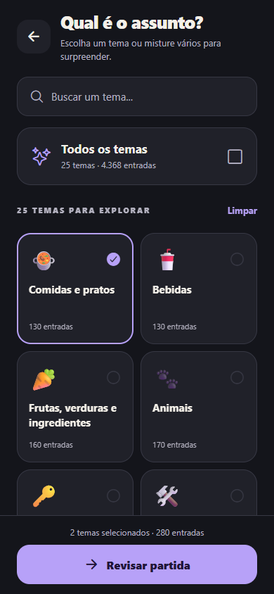

# Impostor

Um celular, uma palavra secreta e alguém tentando disfarçar. Jogo presencial em português do Brasil, para **3 a 20 pessoas**, feito com React Native, Expo SDK 57 e TypeScript estrito.

**[Jogar pelo navegador do celular](https://quem-e-o-impostor.netlify.app/)**


  

## Estado desta entrega

O aplicativo tem o fluxo completo, armazenamento local, temas claros e escuros e proteção da revelação. Os **25 temas estão implementados com um banco editorial inicial**; a exigência original de **1.000 entradas por tema ainda não foi atendida**. Consulte as contagens verificadas e os déficits em [docs/word-report.md](docs/word-report.md).

O usuário autorizou publicar no Netlify esta primeira edição web com **4.368 entradas**, mantendo a expansão para **1.000 por tema** como pendência. A publicação web exige integridade dos bancos. `pnpm words:validate`, `pnpm build`, `pnpm check` e a preparação de builds nativos continuam exigindo a meta completa. Na integração contínua, erros de integridade bloqueiam o fluxo; a verificação da meta de quantidade permanece visível como etapa informativa com `continue-on-error`. `pnpm export:check` verifica separadamente se o código compila, sem aprovar a quantidade de conteúdo.

Resultados executados, limitações e evidências: [docs/verification.md](docs/verification.md).

## Como jogar

1. Cadastre de 3 a 20 pessoas. Três é o mínimo para haver um impostor e pelo menos duas pessoas com a mesma palavra.
2. Organize a passagem do celular arrastando os nomes, pelas setas ou embaralhando a ordem.
3. Escolha um ou vários temas e revise a partida.
4. Entregue o celular à pessoa indicada. Ela confirma que está com o aparelho e mantém o botão pressionado para revelar. Também existe uma alternativa em duas confirmações, compatível com leitores de tela.
5. Pessoas comuns recebem a mesma palavra; exatamente uma pessoa vê apenas **VOCÊ É O IMPOSTOR**. Ao soltar, o segredo desaparece. Confirme a leitura antes de passar adiante.
6. Conversem, deem pistas e tentem descobrir quem está disfarçando. O cronômetro e o palpite do grupo são opcionais.
7. Confirme para revelar o resultado. Jogue novamente com a mesma configuração ou altere a lista e os temas.

## Ambiente e instalação

- Node.js **22.13 ou superior**; projeto verificado com Node 22.14.
- pnpm **11.19.0** (registrado no `packageManager`). Instalação, se necessário: `npm install --global pnpm@11.19.0`.
- Expo Go compatível com SDK 57 em celular Android/iOS, ou um build de desenvolvimento próprio.
- Para desenvolvimento pelo Expo Go, computador e celular devem alcançar o mesmo servidor de desenvolvimento.

```powershell
cd "C:\Users\bruno\OneDrive\Área de Trabalho\BRUNO\05_PROJETOS\Impostor"
pnpm install --frozen-lockfile
pnpm start
```

Escaneie o QR pelo Expo Go no Android ou pela câmera no iOS. Se o terminal indicar um development build, pressione `s` para alternar para Expo Go, ou use `pnpm start --go`. A primeira instalação de dependências usa internet.

```sh
pnpm android           # abre Android conectado/emulador
pnpm ios               # simulador iOS, requer macOS e Xcode
pnpm web               # visualização no navegador
```

Se o `npm` no Windows apontar para uma instalação antiga, use o pnpm disponível ou o executável oficial do Node: `& 'C:\Program Files\nodejs\npm.cmd' --version`. Não é necessário alterar configurações globais do Git para rodar o app.

### Offline

O aplicativo nativo instalado contém todas as palavras, ícones e o som. Não exige conta, servidor, analytics, API nem banco remoto. O Expo Go em desenvolvimento precisa do Metro para carregar o projeto; **o comportamento offline definitivo é o do aplicativo compilado e instalado**. A versão web permite jogar pelo navegador do celular, mas não tem service worker para instalação ou recarregamento offline.

## Comandos de qualidade

| Comando                | Verificação                                                                  |
| ---------------------- | ---------------------------------------------------------------------------- |
| `pnpm typecheck`       | TypeScript estrito e acesso seguro a índices                                 |
| `pnpm lint`            | ESLint, incluindo regras de hooks                                            |
| `pnpm format:check`    | Formatação Prettier                                                          |
| `pnpm test`            | Domínio, sorteio, armazenamento e validador dos bancos                       |
| `pnpm test:ui`         | Componentes, passagem privada e ciclo de vida                                |
| `pnpm words:integrity` | Estrutura, entradas válidas e duplicatas; não aprova a meta de 1.000         |
| `pnpm words:validate`  | Relatório e exigência de pelo menos 1.000 por tema                           |
| `pnpm export:check`    | Exportação de produção Android, iOS e web                                    |
| `pnpm test:e2e`        | Fluxo Playwright contra a exportação web local                               |
| `pnpm build`           | Validação obrigatória de palavras seguida da exportação                      |
| `pnpm build:web`       | Integridade dos bancos, exportação web e preparação de assets para o Netlify |
| `pnpm check`           | Tipos, lint, formatação, testes e conteúdo obrigatório                       |
| `pnpm assets:generate` | Recria ícones e o breve sinal sonoro a partir de código próprio              |

Antes dos testes ponta a ponta, execute `pnpm export:check`. No Windows eles utilizam o Chrome instalado. Em outros sistemas, instale o navegador de testes com `pnpm exec playwright install chromium`. O servidor de testes escuta somente em `127.0.0.1:4173`.

Para verificar uma publicação existente, defina `E2E_BASE_URL` com a URL HTTPS e execute `pnpm test:e2e`. Nesse modo o Playwright testa o site remoto, sem iniciar o servidor local, e salva capturas em `test-results/deployed-screenshots`.

Os testes de sorteio usam uma fonte determinística injetável para reprodutibilidade. O aplicativo usa `expo-crypto`, amostragem por rejeição e Fisher–Yates, evitando o viés do resto da divisão. Os testes verificam distribuição grosseira, sem substituir a fonte aleatória do aplicativo.

## Estrutura

```text
App.tsx                       Composição, navegação e coordenação da sessão
src/
  components/                 Marca, confirmações e lista reordenável
  data/
    catalog.json              Catálogo dos 25 temas
    themes.ts                 Importação offline dos bancos
    words/                    Um arquivo JSON por tema
  domain/                     Tipos, validação, sorteio e máquina de estados
    __tests__/                Testes puros das regras
  hooks/                      Privacidade, feedback, timer e preferências
  screens/                    Início, setup, ajuda e rodada
  services/                   Aleatoriedade nativa e armazenamento versionado
  ui/                         Componentes compartilhados e tokens visuais
scripts/                      Validador, relatórios e geração de assets
tests/                        Componentes e testes ponta a ponta
docs/                         Contagens, arquitetura e validação manual
.github/workflows/            Integração contínua
```

## Arquitetura e privacidade

A máquina de estados é independente do React Native:

```text
entrega → confirmação → pronto ⇄ revelando → ocultado
           próximo jogador ← próxima pessoa ┘
               última pessoa → discussão ⇄ palpite → resultado
```

Ações individuais levam o identificador do jogador atual. Eventos atrasados ou repetidos não avançam outra pessoa. O conteúdo secreto só é montado no estado de revelação e é removido antes de mostrar o próximo nome; não há rotas contendo a palavra nem histórico de telas individuais.

A rodada existe somente em memória. Encerrar o processo descarta a rodada; nomes, temas, preferências e histórico limitado de 80 palavras permanecem. Rascunhos de cadastro também são preservados ao voltar ou reabrir; a partida só inicia depois de validar todos os nomes. O histórico registra a palavra **apenas após o resultado**, nunca enquanto o segredo ainda está em jogo. Sem palavras inéditas no conjunto selecionado, o motor libera a menos recente.

Ao perder foco, o aplicativo cobre o conteúdo e volta a exigir revelação intencional. A proteção nativa é ativada antes de liberar a rodada, permanece ativa durante a sessão e usa também proteção do seletor de aplicativos no iOS. Se a ativação falhar, a informação não é liberada e existe opção de tentar novamente. Consulte a [API ScreenCapture do Expo SDK 57](https://docs.expo.dev/versions/v57.0.0/sdk/screen-capture/).

O armazenamento aceita apenas preferências em um envelope versionado. Corrupção é tratada com padrões seguros. Falha de leitura impede gravação automática para não substituir dados existentes; falha de gravação mantém a sessão funcional e apresenta aviso. Não são solicitadas permissões de microfone, fotos ou armazenamento compartilhado.

### Decisões de jogo

- Um único impostor. O domínio representa seus IDs em uma lista para permitir extensão futura, sem expor uma variante não testada.
- A primeira pessoa da discussão pode ser a primeira da lista ou sorteada. A opção “jogador após o impostor” foi retirada da proposta porque, com a ordem conhecida, permitiria deduzir quem é o impostor.
- A votação é um palpite consensual do grupo; não simula votos secretos individuais.
- Som e vibração são iguais para ambos os papéis. O som é desligado por padrão.
- Temas podem compartilhar uma palavra pertinente a ambos. A normalização e o histórico evitam repetição recente também entre temas; a probabilidade é uniforme entre entradas elegíveis.

## Adicionar palavras e temas

Veja [CONTRIBUTING.md](CONTRIBUTING.md) e [docs/content-notes.md](docs/content-notes.md). Cada entrada tem este formato:

```json
{ "text": "Pão de queijo", "difficulty": "easy", "subtype": "lanche" }
```

`difficulty` aceita `easy`, `medium` e `hard`. `subtype` é opcional. Use português brasileiro, nomes reconhecíveis e classificação editorial; o validador comprova contagens e estrutura, mas não comprova familiaridade ou pertinência sem revisão humana.

Não use números de preenchimento, variações artificiais, duplicatas com acentos diferentes nem material de terceiros sem licença compatível. Cadastre novos temas no catálogo e em `themes.ts`, e execute as duas validações. O relatório de contagem é gerado automaticamente.

## Netlify

O arquivo `netlify.toml` define Node 22, `pnpm run build:web` e a pasta de publicação `dist`. O comando executa `pnpm words:integrity`, exporta somente a versão web e prepara os assets com `scripts/prepare-netlify.mjs`. Entradas inválidas, duplicatas dentro de um tema e inconsistências no catálogo continuam impedindo a publicação.

Após exportar, `scripts/prepare-netlify.mjs` copia assets localizados em diretórios ocultos, como a fonte de ícones dentro de `.pnpm`, para caminhos públicos estáveis e atualiza suas referências. Isso evita que o filtro de arquivos do Netlify omita os ícones.

Em 5 de setembro de 2026, o usuário confirmou expressamente a publicação desta edição web com 4.368 entradas nos 25 temas para acesso pelo celular. A meta original de 25.000 entradas permanece pendente, com déficit de 20.632. O relatório mantém `strictPassed: false`; a autorização da edição web não declara a meta atendida nem libera builds nativos abaixo dela. O deploy foi concluído e os quatro testes de ponta a ponta passaram pela URL HTTPS; as evidências estão em [docs/verification.md](docs/verification.md).

O selo flutuante “Powered by Netlify” está desativado nas configurações gerais do projeto no Netlify, pois interceptava toques sobre um botão em telas de 320 px.

Referências: [exportação web do Expo](https://docs.expo.dev/guides/publishing-websites/) e [configuração por arquivo do Netlify](https://docs.netlify.com/build/configure-builds/file-based-configuration/).

## Builds Android e iOS

Os perfis `development`, `preview` e `production` estão em `eas.json`. Esta entrega não cria conta Expo, projeto remoto, build na nuvem nem publicação automaticamente.

Depois de atender ao controle de conteúdo, para gerar um APK de teste:

```sh
pnpm dlx eas-cli login
pnpm dlx eas-cli build:configure
pnpm dlx eas-cli build --platform android --profile preview
```

Para iOS, use `--platform ios`; distribuição em aparelhos requer os requisitos de assinatura da Apple. Também é possível compilar localmente com Android SDK/JDK ou, para iOS, macOS e Xcode. Ajuste `bundleIdentifier`/`package` se quiser outro identificador de distribuição. Não versione credenciais ou certificados.

Uma exportação Metro/Hermes verifica os pacotes JavaScript para Android/iOS, **não é um APK/IPA assinado**. A validação nativa em dispositivos continua necessária, especialmente seletor de aplicativos, gravação de tela, leitor de tela e gestos. O roteiro está em [docs/device-qa.md](docs/device-qa.md).

## GitHub

Repositório: [brunovini00/quem-e-o-impostor](https://github.com/brunovini00/quem-e-o-impostor), branch `main`. Esta versão substitui a aplicação anterior pelo aplicativo Expo; os commits anteriores permanecem no histórico.

Para obter uma nova cópia:

```sh
git clone https://github.com/brunovini00/quem-e-o-impostor.git Impostor
cd Impostor
pnpm install --frozen-lockfile
pnpm start --go
```

Antes de enviar novas alterações, revise o estado do projeto e execute as verificações pertinentes:

```sh
git status
git diff
pnpm check
```

O envio do código não elimina a pendência editorial: `pnpm words:validate` continua reprovando temas com menos de 1.000 entradas. No GitHub Actions, essa meta é informativa e a integridade dos bancos permanece obrigatória, conforme a autorização da primeira edição web. Consulte as [execuções do GitHub Actions](https://github.com/brunovini00/quem-e-o-impostor/actions) para o resultado remoto. Não houve publicação em lojas nem geração de APK/IPA nesta etapa.

## Licença

Sugestão: **MIT**, sujeita à confirmação do proprietário. Nenhuma licença foi aplicada nesta entrega; confira também as licenças das dependências antes de distribuir.
